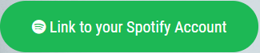

# Gigify

Gigify allows users to ink to their Spotify account, and pull their "affinity data". This gives the app ID numbers for the users favorite artists, and this, in turn, sets up a selectable list that will be used for the embedded player. In addition, these IDs will be used to track down touring data for the selected band through Bandsintown. These two features combine to allow the user to listen to artists they already love, while searching out opportunities to see them live.

## Getting Started

Open your favorite browser, and then visit the published page at [Gigfy](https://tzlomke.github.io/Project_1/). By clicking on the , you will be redirected to put in your credentials, and then the main page will be loaded. On the main page, you can utilize the populated table by clicking on the entries, the embedded player, and the search feature for additional bands.

## Prerequisites

This app works natively in any browser. The user will need a Spotify account (free or premium) in order to utilize the affinity functionality.

## Built With

 - CSS Framework
jQuery

## Versioning

Versioning is performed within GitHub

## Authors

[Taylor Zlomke](https://github.com/tzlomke) - HTML, CSS, JS
[Nathan Peck](https://github.com/ntpeck) - JS
[Brant Keener](https://github.com/BrantKeener) - JS
